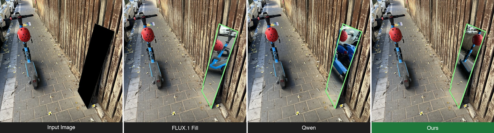

# 🪞 Fill My Mirror
<div align="center">
  <a href="https://google.com"></a>
  <a href='TODO'></a>
  <a href='https://huggingface.co/datasets/OfekBassonResearch/Fill-My-Mirror'></a>
  <a href='https://huggingface.co/datasets/OfekBassonResearch/Fill-My-Mirror-Blender'></a>
</div>
<br>



## Table of Contents
- [Installation](#installation)
- [Quick Start](#quick-start)
- [Command Line Arguments](#command-line-arguments)
- [Example Commands](#example-commands)
- [Batch Inference](#batch-inference)
- [Evaluation](#evaluation)
- [Dataset](#dataset)
- [Default Configuration](#default-configuration)
- [Citation](#citation)

---

Official implementation of **Fill My Mirror**.

This repository contains the code for generating consistent reflections in mirrors by combining **geometry estimation**, **projection**, and **dual-mask diffusion-based inpainting**.

---

<a id="installation"></a>

# 🛠️ Installation

The following instructions were tested on **Linux with Python 3.10**.

## 1. Clone the repository

Clone the repository **with submodules** to also download the MoGe dependency.

```bash
git clone --recurse-submodules https://github.com/OfekBasson/Fill-My-Mirror.git
cd Fill-My-Mirror
```

If you already cloned without submodules, run:

```bash
git submodule update --init --recursive
```

---

## 2. Create a Conda environment

Create a clean environment to avoid dependency conflicts.

```bash
conda create -n fill-my-mirror python=3.10
conda activate fill-my-mirror
```

---

## 3. Install Python dependencies

```bash
pip install -r requirements.txt
pip install -e third_party/MoGe
pip install -e .
```

---

## 4. Install Blender

This project requires **Blender** for scene rendering (and for evaluation on
the Blender dataset).

Run the provided installation script:

```bash
bash scripts/install_blender.sh
```

This downloads and extracts Blender to:

```
external/blender/
```
---

## 5. (Optional) Install MASt3R for evaluation

Required only if you plan to run evaluation with the Reflection Consistency Score
(RCS) masking on real images.

MASt3R is not a pip-installable package — install its dependencies directly:

```bash
pip install -r third_party/MASt3R/requirements.txt
pip install -r third_party/MASt3R/dust3r/requirements.txt
```


---

<a id="quick-start"></a>

# 🚀 Quick Start

Run the example script:

```bash
scripts/run_example.sh
```

Or run directly with your own image and mask:

```bash
python -m fill_my_mirror --image /path/to/image.png --mask /path/to/mask.png
```

Or use a sample from the HuggingFace dataset by index:

```bash
python -m fill_my_mirror --hf-index 0
```

---

<a id="command-line-arguments"></a>

# ⚙️ Command Line Arguments

## Input (required — choose one)

**Option A — local files** (`--image` and `--mask` must be provided together):

| Argument | Description |
|---|---|
| `--image PATH_TO_IMAGE` | Path to the input image |
| `--mask PATH_TO_MASK` | Path to the binary mask of the mirror region |

**Option B — HuggingFace dataset sample:**

| Argument | Description |
|---|---|
| `--hf-index INDEX` | Index of a sample from the HuggingFace dataset (0 to dataset size − 1). The dataset repo is read from `hf_dataset_repo` or `hf_blender_dataset_repo` in the config file. The sample's prompt is used as the prompt unless `--prompt` is also given. |

## Optional arguments

| Argument | Default | Description |
|---|---|---|
| `--config` | `configs/config.yaml` | Path to a YAML configuration file |
| `--blender_path` | *(from config)* | Path to the Blender executable. Overrides the config file value. |
| `--prompt` | *(from config or dataset)* | Text prompt for the diffusion model. Overrides the config file value and any prompt from the HuggingFace sample. |
| `--prompt-2` | — | Optional second text prompt |
| `--output_path` | *(from config)* | Path to save the final output image. Overrides the config file value. |
| `--height` | `1024` | Desired output height |
| `--width` | `1024` | Desired output width. Automatically adjusted to fit the input aspect ratio if needed. |
| `--strength` | `1.0` | Inpainting strength |
| `--num-inference-steps` | `30` | Number of diffusion inference steps |
| `--guidance-scale` | `30.0` | Guidance scale for the diffusion model |
| `--num-images-per-prompt` | `1` | Number of images to generate per prompt |
| `--max-sequence-length` | `512` | Maximum text sequence length |
| `--seed` | `0` | Random seed for reproducibility |
| `--use-blender-data` | `False` | Load a sample from the Blender HuggingFace dataset. Requires `--hf-index`. When set, geometry is read directly from the dataset (no MoGe inference). |
| `--n` | `6.0` | Power `n` for the alpha^n interpolation |
| `--t-prime` | `750.0` | First timestep threshold for mask interpolation |

---

<a id="example-commands"></a>

# 💡 Example Commands

> The file paths below are illustrative — replace them with the actual paths to your image and mask files.

Basic example with local files:

```bash
python -m fill_my_mirror \
  --image /path/to/image.png \
  --mask /path/to/mask.png \
  --prompt "A standing mirror reflects a bed with a dotted cover in a cozy bedroom."
```

Example using a HuggingFace dataset sample (no local files needed):

```bash
python -m fill_my_mirror --hf-index 5
```

Example with a custom output path:

```bash
python -m fill_my_mirror \
  --image /path/to/image.png \
  --mask /path/to/mask.png \
  --output_path outputs/result.png
```

Example with a custom prompt:

```bash
python -m fill_my_mirror \
  --image /path/to/image.png \
  --mask /path/to/mask.png \
  --prompt "Generate a realistic mirror reflection consistent with the scene geometry and lighting."
```

---
<a id="batch-inference"></a>

# 🔁 Batch Inference

Run the pipeline on every sample in the HuggingFace dataset with `scripts/run_batch.py`.
Results are saved as `{output_dir}/seed_{seed}/{index}.png`, ready for use with the batch evaluation command.

```bash
python scripts/run_batch.py --dataset real --output-dir outputs/batch_real/
```

## Arguments

**Required:**

| Argument | Choices | Description |
|---|---|---|
| `--dataset` | `real`, `blender` | Which HuggingFace dataset to use |
| `--output-dir` | | Root output directory. Results saved to `{output_dir}/seed_{seed}/{index}.png` |

**Optional:**

| Argument | Default | Description |
|---|---|---|
| `--config` | `configs/config.yaml` | Path to a YAML configuration file |
| `--start-index` | `0` | First dataset index to process (inclusive) |
| `--end-index` | *(full dataset)* | Last dataset index to process (exclusive) |
| `--skip-existing` | `False` | Skip indices whose output file already exists (useful for resuming) |
| `--blender-path` | *(from config)* | Path to the Blender executable. Overrides the config file value |

All standard pipeline arguments (`--prompt`, `--prompt-2`, `--strength`, `--num-inference-steps`, `--guidance-scale`, `--seed`, `--n`, `--t-prime`, etc.) are accepted and forwarded to the pipeline unchanged — see [Command Line Arguments](#command-line-arguments) for their descriptions and defaults.

---
<a id="evaluation"></a>

# 📊 Evaluation

Metrics are reported for two regions of the mirror and the full image:

<table>
<tr><th>Metric</th><th>Region</th><th>Description</th></tr>
<tr><td><code>clip_similarity</code></td><td>Full image</td><td>CLIP ViT-B/32 image–text cosine similarity</td></tr>
<tr><td><code>psnr_full_mirror</code></td><td rowspan="3">Full mirror mask</td><td>PSNR restricted to mirror pixels</td></tr>
<tr><td><code>ssim_full_mirror</code></td><td>SSIM restricted to mirror pixels</td></tr>
<tr><td><code>lpips_full_mirror</code></td><td>LPIPS restricted to mirror pixels</td></tr>
<tr><td><code>psnr_constrained</code></td><td rowspan="3">Constrained pixels only</td><td>PSNR restricted to geometrically-determined pixels</td></tr>
<tr><td><code>ssim_constrained</code></td><td>SSIM restricted to geometrically-determined pixels</td></tr>
<tr><td><code>lpips_constrained</code></td><td>LPIPS restricted to geometrically-determined pixels</td></tr>
</table>

## Running Evaluation

Evaluate a **single locally provided image** (no dataset required):

```bash
python scripts/evaluate.py local \
  --generated /path/to/generated.png \
  --gt /path/to/gt_image.png \
  --mask /path/to/mask.png \
  --save-dir eval/sample_0/ \
  --prompt "A standing mirror reflects a bed with a dotted cover in a cozy bedroom."
```

**`local` arguments — required:**

| Argument | Description |
|---|---|
| `--generated` | Path to the generated/inpainted image |
| `--gt` | Path to the ground-truth image |
| `--mask` | Path to the binary mirror mask |
| `--save-dir` | Directory to save the metrics CSV |

**`local` arguments — optional:**

| Argument | Default | Description |
|---|---|---|
| `--prompt` | — | Text prompt for CLIP similarity |
| `--rcs-dilation` | `5` | Dilation radius for the RCS mask |
| `--config` | `configs/config.yaml` | Path to a YAML configuration file |

Evaluate a **batch of results** against the **real-images HuggingFace dataset**:

```bash
python scripts/evaluate.py batch \
  --results-dir outputs/my_run/ \
  --dataset real \
  --output-dir outputs/eval/real/
```

Evaluate against the **Blender dataset**:

```bash
python scripts/evaluate.py batch \
  --results-dir outputs/blender_run/ \
  --dataset blender \
  --output-dir outputs/eval/blender/
```

**`batch` arguments — required:**

| Argument | Choices | Description |
|---|---|---|
| `--results-dir` | | Directory containing result PNGs named `{index}.png` |
| `--dataset` | `real`, `blender` | Which HuggingFace dataset to load ground truth from |
| `--output-dir` | | Directory to save per-sample and aggregate CSVs |

**`batch` arguments — optional:**

| Argument | Default | Description |
|---|---|---|
| `--prompt` | — | Override CLIP prompt for all samples |
| `--rcs-dilation` | `5` | Dilation radius for the RCS mask |
| `--blender-path` | *(from config)* | Path to the Blender executable (needed for `--dataset blender`) |
| `--config` | `configs/config.yaml` | Path to a YAML configuration file |

## Constrained Pixels Mask

The constrained mask isolates mirror pixels whose appearance is geometrically
determined by the visible scene — enabling a more faithful evaluation of
reflection correctness than metrics over the full mirror region.

**Real images (HF dataset or local)** — computed via the **Reflection Consistency Score (RCS)**:
MASt3R finds dense correspondences between the scene view and a flipped mirror
view; matched mirror pixels are dilated and intersected with the mirror mask.

**Blender dataset** — derived from **ground-truth 3D geometry**: the projection
pipeline is run with GT point cloud and intrinsics; pixels covered by the
projection are the constrained region.

---
<a id="dataset"></a>

# 📦 Dataset

Two datasets are provided:

### [Real Images Dataset](https://huggingface.co/datasets/OfekBassonResearch/Fill-My-Mirror)

Contains 50 real-world mirror scenes with the following columns per sample:

| Column | Type | Description |
|---|---|---|
| `id` | int32 | Sample index |
| `image` | image | Input image (mirror region is black) |
| `mask` | image | Binary mask of the mirror region |
| `gt_image` | image | Ground-truth image (mirror filled) |
| `prompt` | string | Text description of the scene |

### [Blender Synthetic Dataset](https://huggingface.co/datasets/OfekBassonResearch/Fill-My-Mirror-Blender)

Contains 15 rendered Blender scenes with mirrors, including ground-truth mirror masks, geometry, and manually assigned prompts.

| Column | Type | Description |
|---|---|---|
| `id` | int32 | Sample index |
| `image` | image | Rendered scene image |
| `mask` | image | Ground-truth binary mask of the mirror region |
| `gt_image` | image | Ground-truth image (mirror filled) |
| `prompt` | string | Manually assigned text description of the scene |
| `points` | float32 (800×800×3) | 3D point cloud of the scene geometry |
| `depth` | float32 (800×800) | Depth map of the scene |
| `intrinsics` | float32 (3×3) | Camera intrinsics matrix |

---
<a id="default-configuration"></a>

# 📁 Default Configuration

The default configuration is stored in `configs/config.yaml`:

```yaml
prompt: "Complete the mirror reflection realistically and consistently with the scene geometry."
default_output_path: "outputs/result.png"
blender_path: "external/blender/blender-4.4.3-linux-x64/blender"
geometry_model_name: "Ruicheng/moge-2-vitl-normal"
inpainting_model_name: "black-forest-labs/FLUX.1-Fill-dev"
hf_dataset_repo: "OfekBassonResearch/Fill-My-Mirror"
hf_blender_dataset_repo: "OfekBassonResearch/Fill-My-Mirror-Blender"
mast3r_model_name: "naver/MASt3R_ViTLarge_BaseDecoder_512_catmlpdpt_metric"
```

---
<a id="citation"></a>

# 📝 Citation

If you use this code in your research, please cite:

```bibtex
@article{fill_my_mirror,
  title={Fill My Mirror},
  author={Basson, Ofek and Vainer, Shimon and Hel-Or, Yacov and Fried, Ohad},
  year={2025}
}
```
